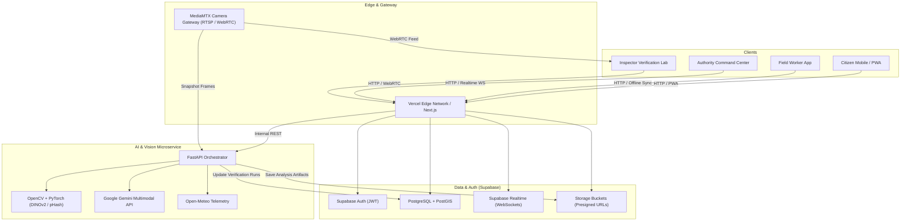

# GROUND0 — System Architecture

**Tagline**: *Verify the Work. Reveal the Reality.*  
**Domain**: AI-Powered Proof of Physical Work & Municipal Trust Infrastructure

---

## 1. High-Level System Architecture

Ground0 is engineered as a decoupled, microservices-oriented platform composed of three primary operational tiers:

1. **Client & Web Application Tier (`apps/web`)**
   - **Framework**: Next.js 14/15 (App Router, Server Components & Server Actions, React 18/19, TypeScript).
   - **UI System**: Royal Obsidian Design System (Tailwind CSS, Radix UI primitives, Lucide Icons).
   - **3D Visual Engine**: Three.js / React Three Fiber / Drei for the interactive smart city hero scene.
   - **Geospatial Engine**: MapLibre GL JS + MapTiler tiles for spatial complaint exploration, marker clustering, and heatmaps.
   - **PWA Module**: Offline-first service worker and local SQLite/IndexedDB caching for field workers operating in low-connectivity zones.

2. **Data & Identity Fabric (`supabase`)**
   - **Database**: PostgreSQL 15+ hosted on Supabase with PostGIS extensions for spatial indexing.
   - **Identity & Access**: Supabase Auth with Row-Level Security (RLS) enforcing strict tenant and role segregation across 8 distinct user tiers.
   - **Realtime Bus**: Postgres CDC (Change Data Capture) via Supabase Realtime WebSockets for instant dashboard alerts and status updates.
   - **Blob Storage**: Secure S3-compatible buckets with time-limited cryptographic presigned URLs for raw evidence, redacted media, and AI heatmaps.

3. **Autonomous AI & Computer Vision Service (`apps/ai-service`)**
   - **Framework**: Python 3.11+ / FastAPI with asynchronous worker queues.
   - **Vision Pipeline**: OpenCV, PyTorch, DINOv2 / SigLIP visual embeddings, and SSIM / perceptual hashing for scene geometry and physical change detection.
   - **Multimodal LLM**: Google Gemini 1.5/2.0 Flash / Pro for semantic complaint synthesis, requirement extraction, and multi-modal justification reports.
   - **Media Gateway**: MediaMTX integration for ingesting ONVIF / RTSP camera streams and transrating to WebRTC/HLS with automated edge privacy redaction (face and plate blurring).



---

## 2. End-to-End Workflow Pipeline

Ground0 executes a 10-phase closed-loop cycle from issue detection to permanent verifiable closure:

```
[1. Citizen Report] (Photo + GPS + Audio + Category + Weather Context)
         │
         ▼
[2. AI Complaint Intake] (Gemini Multimodal Analysis + Duplicate Spatial Clustering)
         │
         ▼
[3. Master Issue / Work Order Creation] (Authority Reviews & Dispatches Contractor)
         │
         ▼
[4. Worker Dispatched] (Worker accepts job on PWA, heads to GPS site)
         │
         ▼
[5. BEFORE Evidence Capture] (Server Nonce + Device Sensors + SHA-256 + Perceptual Hash)
         │
         ▼
[6. Physical Remediation] (Physical work executed on site)
         │
         ▼
[7. AFTER Evidence Capture] (Multi-Angle Challenge + Nonce + Cryptographic Tamper Check)
         │
         ▼
[8. Ground0 8-Stage AI Verification Pipeline]
    ├─ 1. Evidence Integrity (Hash duplicate check, nonce validation, EXIF consistency)
    ├─ 2. Location Geofence (Haversine/PostGIS distance against complaint origin)
    ├─ 3. Scene Matching (DINOv2/SigLIP feature homography between Before & After)
    ├─ 4. Physical Change Detection (Area segmentation of pothole/waste clearance)
    ├─ 5. Work Order Requirement Verification (Gemini checks criteria satisfaction)
    ├─ 6. CCTV Cross-Correlation (Passive validation from authorized cameras)
    ├─ 7. Risk Analysis (Synthesis of anomaly flags, lighting checks, confidence)
    └─ 8. Recommendation Generation (Structured JSON with explanation)
         │
         ▼
[9. Human Inspector Decision] (Inspector approves/rejects with full audit trail)
         │
         ▼
[10. Citizen Transparent Resolution] (Interactive Before/After slider + Citizen Confirm)
```

---

## 3. Core Software Subsystems

### 3.1. Web Application (`apps/web`)
- **App Router Pages**:
  - `/`: Cinematic 3D landing page with real-time city infrastructure state.
  - `/report`: Progressive multimodal citizen issue submission flow.
  - `/track`: Public tracking portal with complaint ID lookup.
  - `/complaint/[id]`: Interactive timeline and resolution view.
  - `/dashboard`: Comprehensive authority command center with live telemetry.
  - `/complaints`: Master complaints grid with spatial filtering.
  - `/issues`: Master deduplicated issues and clusters.
  - `/work-orders`: Work order lifecycle management and dispatch.
  - `/work-orders/[id]`: Detailed work order specification and assignments.
  - `/capture/[id]`: Mobile-optimized field worker PWA for verified capture.
  - `/verification-lab`: Dual-pane inspector verification suite with diff overlays.
  - `/verification/[id]`: Deep audit breakdown of an AI verification run.
  - `/cameras`: Live CCTV wall with 2x2, 3x3, and 4x4 matrix view and privacy blur.
  - `/map`: Fullscreen interactive MapLibre operations map.
  - `/analytics`: Real-time municipal KPIs and sustainability impact metrics.
  - `/audit`: Immutable tamper-evident system event log.

### 3.2. AI Verification Microservice (`apps/ai-service`)
- **FastAPI Core**:
  - `POST /api/v1/analyze-complaint`: Evaluates visual issue category, severity, and description.
  - `POST /api/v1/cluster-duplicates`: Spatial & semantic grouping of incoming reports.
  - `POST /api/v1/verify-work`: Full 8-stage verification execution engine.
  - `POST /api/v1/cctv-event`: Ingests frame buffers for automated event spotting.
- **Computer Vision Pipeline**:
  - Feature matching using ORB / SIFT homography and deep visual features (DINOv2).
  - Difference map calculation and adaptive contour masking.
  - Waste volume / pothole depth estimation heuristics.

### 3.3. Media Gateway Service (`services/media-gateway`)
- Standardized RTSP/ONVIF gateway powered by MediaMTX.
- WebRTC streaming to eliminate latency (< 500ms).
- Automated Edge Privacy Filter: Incidental human faces and vehicle license plates are masked before video frames enter storage or browser rendering.

---

## 4. Production Deployment Topology

- **Web Frontend**: Vercel (Edge routing, server actions, CDN caching).
- **Database & Storage**: Supabase (Multi-AZ PostgreSQL 15, PostGIS, Storage, Realtime).
- **AI Microservice**: Containerized Python service on Railway / Render / Fly.io / VPS with GPU acceleration support.
- **Media Gateway**: Persistent Docker container running MediaMTX with exposed RTSP/WebRTC ports.
- **External APIs**: Open-Meteo (Weather telemetry, no secret required), MapTiler (Vector tile rendering), Google Gemini 1.5/2.0 (Multimodal reasoning).
