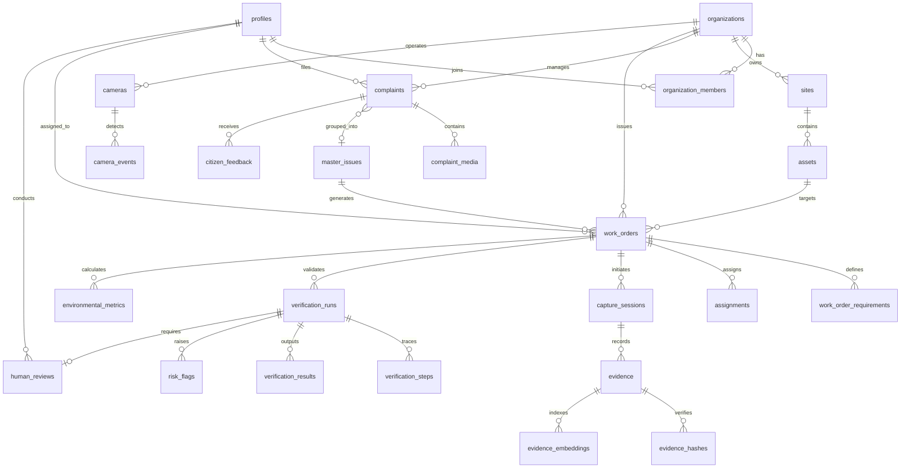

# GROUND0 — Database Schema & Data Architecture

Ground0 utilizes PostgreSQL 15+ hosted on Supabase, leveraging relational integrity, PostGIS spatial indexing, Row-Level Security (RLS), and Postgres Change Data Capture (CDC) via Supabase Realtime.

---

## 1. Entity-Relationship Overview

---

## 2. Table Catalog

### 2.1. Identity & Organization
1. `profiles`: User details, role enum, avatar URL, phone, verification level.
2. `organizations`: Municipal entities, departments, and contractors.
3. `organization_members`: Role within an organization (`ORGANIZATION_ADMIN`, `PROJECT_MANAGER`, `INSPECTOR`, `CONTRACTOR`, `FIELD_WORKER`, `AUDITOR`).

### 2.2. Complaints & Intake
4. `complaints`: Citizen submitted issues with GPS coordinates, category, severity, address, status, and AI triage scores.
5. `complaint_media`: Photos, videos, and voice recordings attached to complaints.
6. `master_issues`: Clusters of duplicate/nearby complaints representing a single physical defect.
7. `complaint_issue_links`: Many-to-many relationship mapping complaints to a master issue.
8. `citizen_feedback`: Citizen confirmation after closure (whether issue was truly solved or reopened).

### 2.3. Physical Infrastructure & Work Orders
9. `sites`: Physical geographic zones, wards, and municipal districts.
10. `assets`: Specific infrastructure elements (e.g., Bridge 14, Main St Drainage System).
11. `projects`: High-level municipal initiatives or maintenance campaigns.
12. `work_orders`: Formal work orders issued to contractors with deadlines and completion criteria.
13. `work_order_requirements`: Specific verifiable physical criteria (e.g., "Full clearance of 15m² debris", "Asphalt compaction").
14. `assignments`: Field worker and contractor dispatch schedules and status.

### 2.4. Evidence & Field Capture
15. `capture_sessions`: Cryptographically secured capture challenges issued by the server with timestamps, GPS bounds, and nonces.
16. `evidence`: Raw and redacted photos and videos captured by workers (Before and After stages).
17. `evidence_hashes`: SHA-256 cryptographic hashes and pHash perceptual hashes to detect duplicate and replayed media.
18. `evidence_embeddings`: High-dimensional vector embeddings (DINOv2/SigLIP) for visual scene identity matching.

### 2.5. AI Verification & Inspection
19. `verification_runs`: Multi-stage verification execution record, tracking overall status, confidence, and timestamps.
20. `verification_steps`: Granular status and outputs for each of the 8 pipeline stages.
21. `verification_results`: Final comparison metrics (Scene Match %, Physical Change %, Requirement Score).
22. `risk_flags`: Tamper alerts, GPS anomalies, replay flags, and visual discrepancies detected by AI.
23. `human_reviews`: Official inspector review records (Approved, Rejected, Request More Evidence) with justification.

### 2.6. CCTV, Sustainability & Audit
24. `cameras`: Authorized municipal camera configurations (RTSP/WebRTC streams, location, status).
25. `camera_events`: Snapshots and events logged by camera edge vision workers.
26. `environmental_metrics`: Quantitative sustainability impacts (waste mass, area cleaned, avoided inspection travel, CO2 avoided) labeled MEASURED, REPORTED, or ESTIMATED.
27. `notifications`: In-app realtime alerts for citizens, workers, and municipal authorities.
28. `audit_events`: Tamper-evident, immutable system audit log capturing every state transition and security event.

---

## 3. Row-Level Security (RLS) Policy Architecture

Ground0 enforces granular access control directly at the database layer via PostgreSQL Row-Level Security:

- **CITIZEN**:
  - `SELECT`: Can view their own complaints, public verified master issues, and public resolution timelines.
  - `INSERT`: Can create complaints and upload complaint media.
  - `UPDATE`: Can submit feedback on their own resolved complaints.
- **FIELD_WORKER**:
  - `SELECT`: Can view work orders assigned to them or their contractor organization.
  - `INSERT`: Can create capture sessions and submit Before/After evidence.
- **INSPECTOR**:
  - `SELECT`: Full access to complaints, evidence, verification runs, and camera feeds within their organization.
  - `INSERT / UPDATE`: Can record human review decisions and add official inspection notes.
- **PROJECT_MANAGER & ORGANIZATION_ADMIN**:
  - Full CRUD on work orders, assignments, requirements, cameras, and contractor associations within their organization.
- **AUDITOR**:
  - Read-only access to all tables including `audit_events`, `risk_flags`, and raw verification telemetry.
- **SUPER_ADMIN**:
  - Global administrative privileges across organizations.
